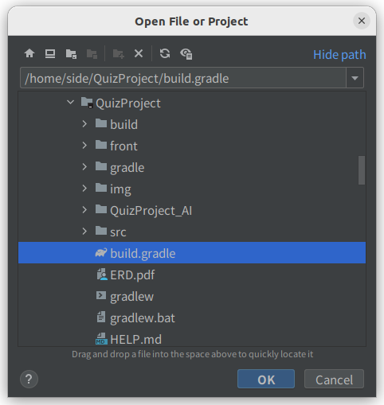
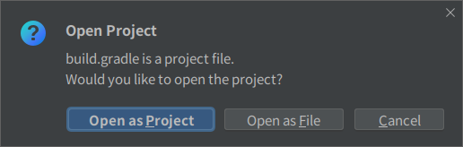
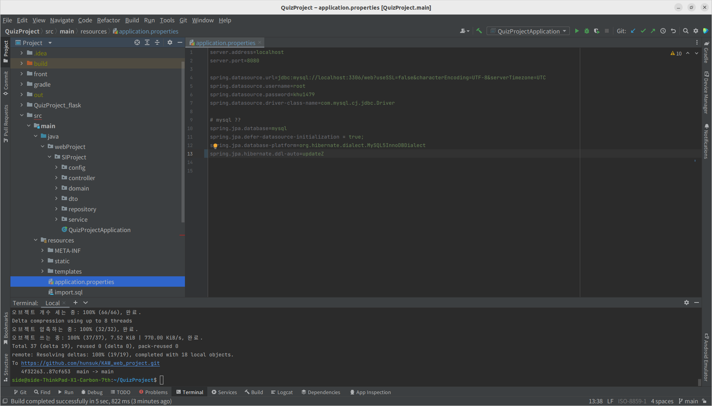
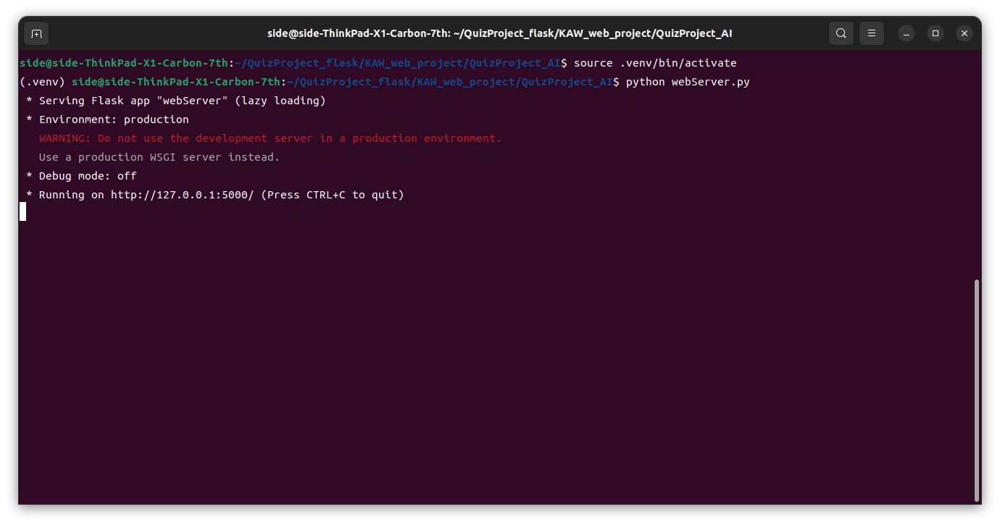

# KAW_web_project

# Spring 서버 실행
0. IDE는 Intelij를 사용 하고 JDK는 JAVA 11를 사용

1. build는 gradle로 하며 아래와 같이 클릭후 Open as Project를 클릭
   
   

2. JDK 설정은 ctrl+alt+shift+s를 통해 설정
 

3.shift+F10를 눌러 프로젝트 실행 

# Mysql 서버 등록

1. 클론 후 ../QuizProject/src/main/resources 폴더에 있는 application.properties 파일에 자신의 Mysql 서버 등록

2. spring.datasource.url=jdbc:mysql://localhost:3306/web?useSSL=false&characterEncoding=UTF-8&serverTimezone=UTC
   spring.datasource.username=root
   spring.datasource.password=khu1479
   
   위의 형식을 따를것
    

# python Flask 서버 실행

1. 클론 후 ../QuizProject/QuizProject_AI 폴더에 있는 .venv를 이용하여 가상환경 실행
2. pip install 을 통해 requermentlib에 있는 라이브러리를 설치 할 것
3. python webServer.py를 입력 하여 서버 실행

