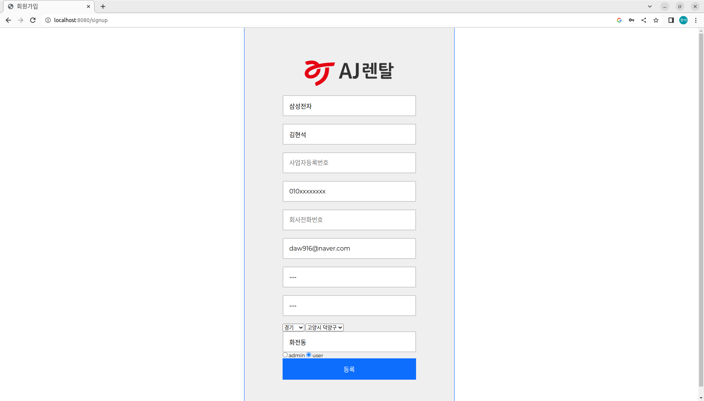

# KAW_web_project

# Spring 서버 실행
0. IDE는 Intelij를 사용 하고 JDK는 JAVA 11를 사용

1. build는 gradle로 하며 아래와 같이 클릭후 Open as Project를 클릭

2. JDK 설정은 ctrl+alt+shift+s를 통해 설정

3.shift+F10를 눌러 프로젝트 실행 

# Mysql 서버 등록

1. 클론 후 ../QuizProject/src/main/resources 폴더에 있는 application.properties 파일에 자신의 Mysql 서버 등록

2. spring.datasource.url=jdbc:mysql://localhost:3306/web?useSSL=false&characterEncoding=UTF-8&serverTimezone=UTC
   spring.datasource.username=root
   spring.datasource.password=khu1479
   
   위의 형식을 따를것
    

# python Flask 서버 실행

1. 클론 후 ../QuizProject/QuizProject_AI 폴더에 있는 .venv를 이용하여 가상환경 실행
2. pip install 을 통해 requermentlib에 있는 라이브러리를 설치 할 것
3. python webServer.py를 입력 하여 서버 실행

# 로그인 페이지

# 회원가입 페이지

# 일반유저 메인 페이지

1. 아주렌탈 파렛트 25개의 영업지점을 지도에 표시하고 자신의 위치를 중심으로 표현

# 내정보

1. 메인 페이지 우측상단에 내정보를 클릭시 해당 페이지로 이동
2. 회원가입때 입력한 정보 확인가능
2. 정보수정은 미구현

# 파렛트 발주 페이지

1. 메인 페이지 중간 버튼 중 파렛트 랜탈하러 가기! 클릭시 해당 페이지로 이동
2. 제품 담기 및 취소 기능인 장바구니 기능 표현(완전한 구현은 x)

# 파렛트 발주 주문 페이지

1. 선택 박스에서 최종 선택 가능
2. 갯수및 기간 설정 가능
3. 유저 추가 문의 사항 입력 가능

# 파렛트 발주 주문 현황 페이지

1. 메인 페이지 에서 주문 현황보러 가기! 클릭시 해당페이지로 이동
2. 주문된 상태 및 주문 삭제 기능 구현

# 관리자 메인 페이지

# 관리자 발주관리 페이지

1. 관리자 메인 페이지에서 주문 관리하러 가기! 클릭시 해당 페이지로 이동
2. 배송처리(처리중 -> 배송준비중) 및 주문서 삭제 기능 구현
3. 이전 주문현황에서 각 주문의 유저의 정보 추가

# AI예측통계 보러가기!
1. 관리자 메인페이지 에서 AI예측통계 보러가기! 클릭시 해당 페이지로 이동
2. 사전에 로컬에 엑셀로 몇몇 기업의 매출,순매출을 기록
3. 유저가 해당 기업을 입력 하면 4가지 그래프(매출(분기,년), 순이익-매출(분기,년)을 표현

